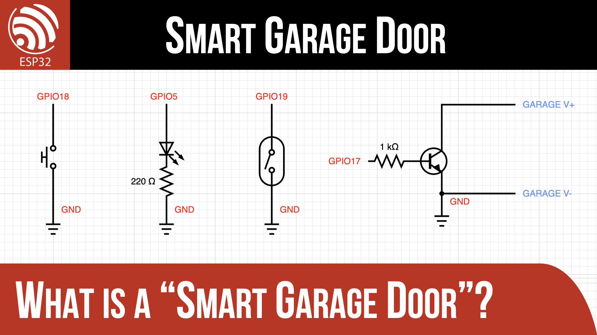
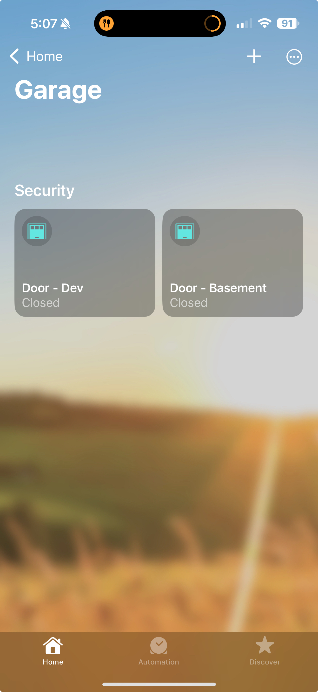
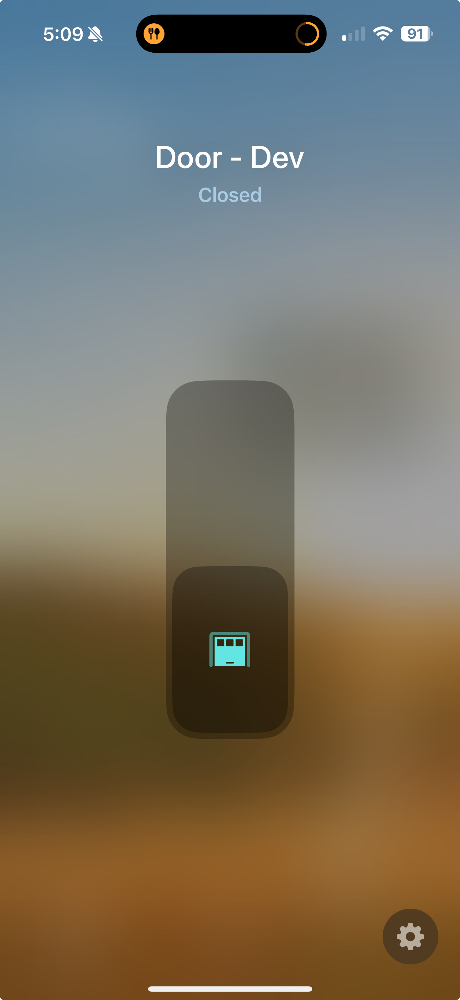
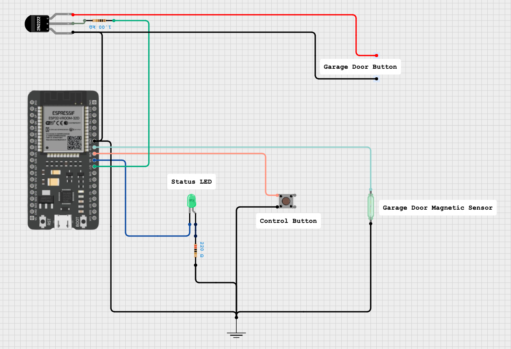
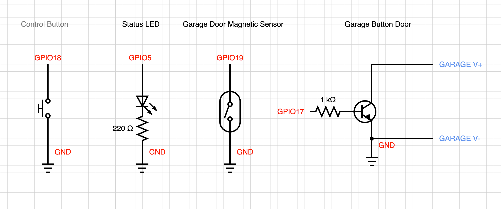
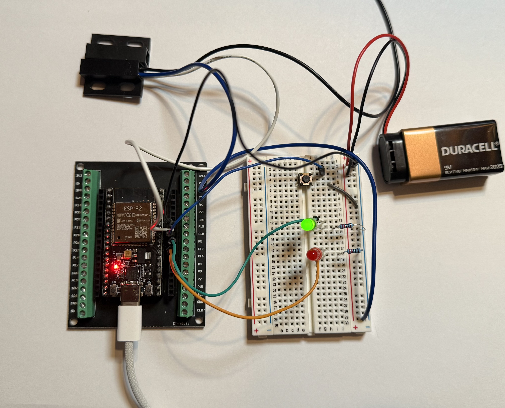
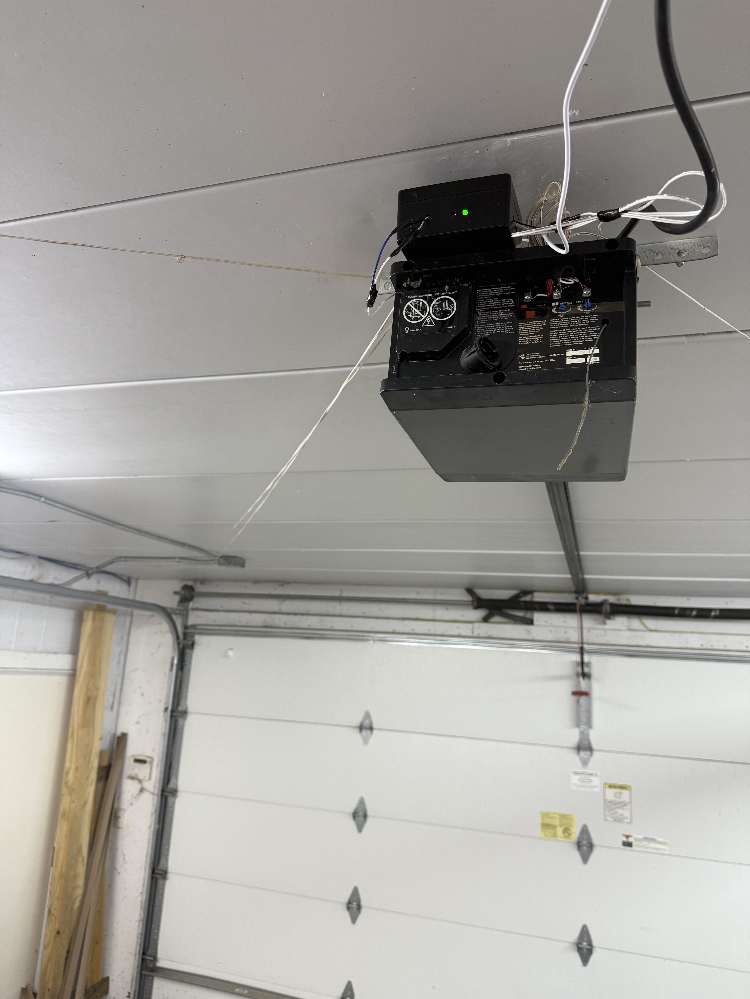
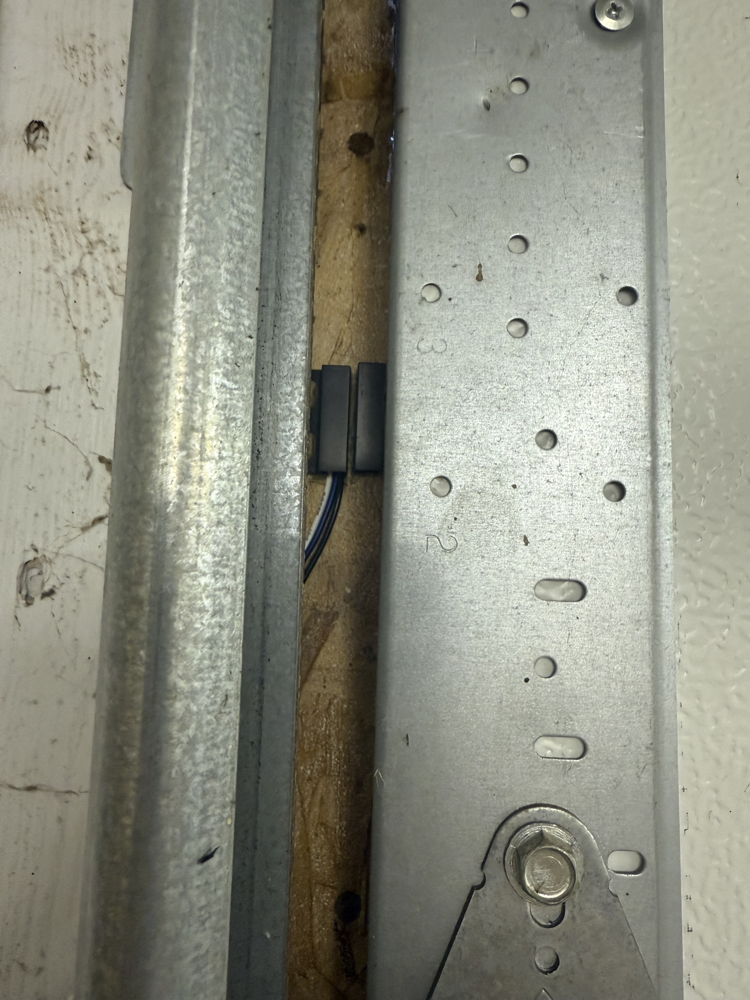

# ESP32 Smart Garage Door

**DISCLAIMER: You assume all risk associated with building this project. I cannot personally inspect your work or determine if your Garage Door unit is compatible with this device. I am not responsible if you damage, blow up, get blown up, fall, start a fire, or any other outcomes good or bad that may happen while you are inspired by this project!!!**

## Purpose
Ever come home to find your garage door has been opened while you were gone? This project converts an existing garage door into a "smart" garage door by adding the following features:

1. Open/Closed Indicator
2. Remote Door Switch

These features are provided via an integration into Apple HomeKit (a.k.a. Home App). Here are a few screenshots from the Apple Home app:

## Circuit Diagram

The individual circuits are:

In the above, the RED labels are the ESP32 pins. The BLUE labels are the garage door unit control terminals. NOTE: One should have a positive voltage and the negative side is connected to the ESP32 ground to form a common ground plane.

The ESP32 has the following interactions:

- **Garage Door Magnetic Sensor** is a magnetic reed switch in a NC (normally closed) configuration. This ensures if the wire gets cut, the sensor faults to "open" and will send alerts.
- **Garage Door Button** are two wires that connect to the garage door motor unit. This only works on units that provide two terminals that when shorted together starts the door moving. One of the wires will be at a higher voltage and it IS IMPORTANT THAT ONE IS CONNECTED to the collector of the driving transistor.
- **Status LED** is an indicator used by the HomeSpan code. It flashes based on mode and status. Refer to <a href="https://github.com/HomeSpan/HomeSpan">HomeSpan documentation</a> for details.
- **Control Button** is used to manually toggle the device into various configuration modes. Refer to <a href="https://github.com/HomeSpan/HomeSpan">HomeSpan documentation</a>.

## Development Board

Above you can see the development environment I used. On the bread board you can identify:

- `Push Button` - This is the "control button".
- `Green LED` - This is the "status LED".
- `Red LED` - This is the simulation of the "Garage Door Button". I can see the LED turn on when the button is pushed. The 9V battery is providing the DC voltage that the garage door unit provides between the button wires. The ESP32 is "shorting" these two wires together briefly to initiate the garage door moving.
- `Black Magnetic Switch` - This can be seen just above the ESP32. This unit has 3 wires to support NO/NC (normally open/closed) configurations. I am using the blue & white wires for a NC configuration.
- `ESP32` and `Development Board` - I like this development board as it provide jumper pin options for development and for production you can use the screw terminal to ensure the wires are not coming loose.
- NOT SHOWN: The 2N2222 transister & 1kΩ base resistor that is used as a "driver/isolation circuit" for the "garage door button".

## Parts
- [ESP32 Board + Breakout Kit](https://www.amazon.com/dp/B0C8DBN29X)
- [Project Box](https://www.amazon.com/dp/B083H9FNRT)
- [Magnetic Switch](https://www.amazon.com/dp/B085XQLQ3N)
- [Control Button](https://www.amazon.com/DAOKI-Miniature-Momentary-Tactile-Quality/dp/B01CGMP9GY)
- [Status LED](https://www.amazon.com/MCIGICM-Circuit-Assorted-Science-Experiment/dp/B07PG84V17)
- [LED Resistor (220ohm)](https://www.amazon.com/California-JOS-Resistance-CJ50-004-220/dp/B0BDKQSZHM)
- [2N2222 Transistor](https://www.amazon.com/ALLECIN-2N2222-Amplifier-Transistors-Transistor/dp/B0CBK1T5FQ)
- [Base Resistor (1kohm)](https://www.amazon.com/California-JOS-Carbon-Resistor-Tolerance/dp/B0BR66ZN6B)
- [Wire](https://www.amazon.com/dp/B0DP3TGB3W)

## Code
The code for this project is in the "code" directory. It consists of the following files in the `src` directory:

- `Console.cpp` & `Console.h` - Wrapper around `Serial.print` functions to control when to print Error, Info, and Verbose message.
- `DoorButton.cpp` & `DoorButton.h` - Wrapper around the "Garage Door Button" features.
- `DoorSensor.cpp` & `DoorSensor.h` - Wrapper around the "Garagae Door Magnetic Sensor" features.
- `GarageDoor.cpp` & `GarageDoor.h` - Wrapper around the high-level garage door features. Provides the integration with Apple Home via <a href="https://github.com/HomeSpan/HomeSpan">HomeSpan</a>.
- `main.cpp` - Entry point for the application. Provides the setup and main loop.
- `Timer.cpp` & `Timer.h` - Wrapper around a simple timer features that is used in multiple places.

Other files of interest are:
- `platformio.ini` - This configures the board, framework, and external dependencies.

## Connect to WiFi
After installing and powering on the device:

1. Click and hold the "control button" until the "status LED" flashed rapidly.
2. Release the "control button" and you should be in "configuration mode" with the "status LED" blink once.
3. Press and release the "control button" and the "status LED" should blink twice.
4. Press and release the "control button" and the "status LED" should blink three times.
5. Press and HOLD the "control button" to enter launch HomeSpan's temporary WiFi network.
6. Use your iPhone to connect to the "GarageGenie" WiFi access point using "password" as the password. NOTE: These are set in the code, so if you modified then use the new SSID/password.
7. Provide the WiFi SSID and password for the network you want the device to join.
8. Enter a pairing code (you will need this when you pair). The default is 1112-2333.

For more info: <a href="https://github.com/HomeSpan/HomeSpan/blob/master/docs/UserGuide.md">HomeSpan User Guide</a>

## Pairing to Home App
After the device has WiFi connectivity:

1. On your iPhone open the Home App.
2. Select the "Add Accessory" or the "+" option in the upper-right corner.
3. Follow the directions in Home App. When asked, enter the pairing code.

For more info: <a href="https://github.com/HomeSpan/HomeSpan/blob/master/docs/UserGuide.md">HomeSpan User Guide</a>

## Over-The-Air Updates
Once installed, the device can receive over-the-air (OTA) updates. The `main.cpp` file enables this along with automated rollback if the new release doesn't make it through the setup phase. To peform an OTA update in VS Code:

1. Determine the IP Address of the device.
2. In the `platformio.ini` file uncomment the `upload_protocol` and `upload_flags` lines.
3. At the bottom, click the "Set upload/monitor/test port" button. Select "Custom..." and enter the IP Address.

The upload should now be pushed OTA to the device.

## Installation
I cannot tell you how to install this device in your environment. I will provide a few photos from my installation:

Above you can see I mounted the device (in the black box with the green LED) using 3M adhesive tape to the top of my garage door unit. 

**Garage Door Button**

My unit has 3 "screw terminals" at the top. I followed the wall mounted button's wire and it is mounted to the left-two screw terminals. The left most one measured positive and I connected this one to the collector side of the "Garage Door Button".

> DISCLAIMER: I am not responsible for any damage if you do this!
> 
> Before mounting you can test if your garage door unit is compatible by briefly shorting these two terminals together.

**Garage Door Magnetic Sensor**

I followed the wiring of the existing "light beam sensor" to the left-side of my garage door. It is important that this wire be tight enough and not sag into the door as it operates.

I installed the magnetic sensor along the left-side of the door. I mounted the "wired portion" to the frame using "liquid nails" and the "magnet portion" to the door using more of the 3M adhesive tape. This sensor has a range of around 3/4". Be sure to leave a gap of around 1/8" to prevent the two parts from colliding when the door is in operation.

## References

- <a href="https://forum.iobroker.net/assets/uploads/files/1634848447889-apple-spezifikation-homekit.pdf" target="_blank">Apple Home Kit Spec</a>
- <a href="https://github.com/HomeSpan/HomeSpan" target="_blank">HomeSpan Repo</a>
- <a href="https://www.reddit.com/r/homeautomation/comments/wjhm9c/how_do_the_simple_wall_switches_on_garage_door/" target="_blank">Discussion On Garage Door Wall Switches</a>
- <a href="https://app.cirkitdesigner.com/project/e83cdded-e52b-4814-ba58-870e42daf97c" target="_blank">Cirkit Diagram</a>
- <a href="https://crcit.net/c/d1eeae9e315a4bb2b5e7f52645e922a7" target="_blank">Sub Circuits</a>